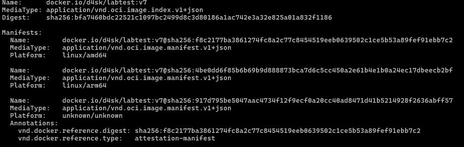
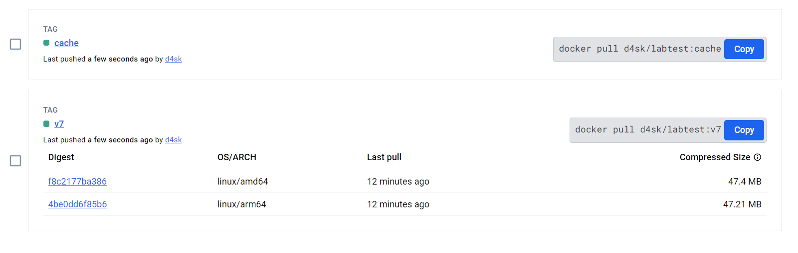
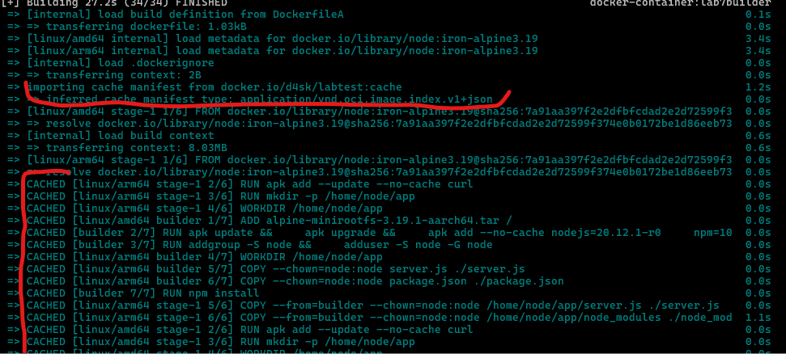

# Laboratorium 7

- [Repozytorium dockerhub](https://hub.docker.com/repository/docker/d4sk/labtest/general)

### Budowanie obrazu 

``
docker buildx build -q -f DockerfileA -t docker.io/d4sk/labtest:v7 --platform linux/amd64,linux/arm64 --cache-to type=registry,mode=max,ref=docker.io/d4sk/labtest:cache --cache-from type=registry,ref=docker.io/d4sk/labtest:cache --push .
``

opcje ``--cache-to`` oraz ``--cache-from`` służa do definicji zapisaywania cache pod oddzielnym tagiem

### Sprawdzanie manifesu obrazu

``docker buildx imagetools inspect docker.io/d4sk/labtest:v7``

### Sprawdzanie cache

 
 cache zostało zapisane jako oddzielny tag "cache" w repo

pobranie danych cache z repo oraz wykorzysatnie ich w procesie budowania
